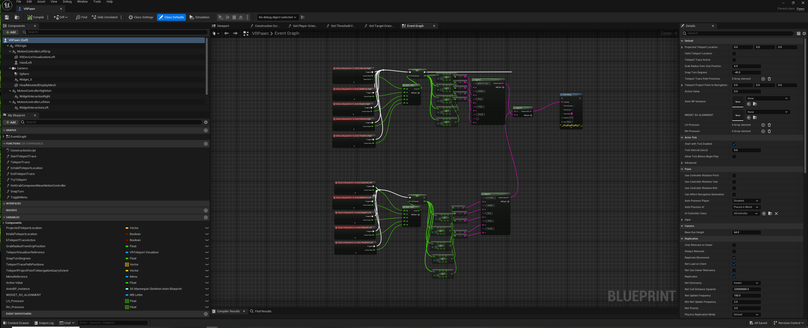
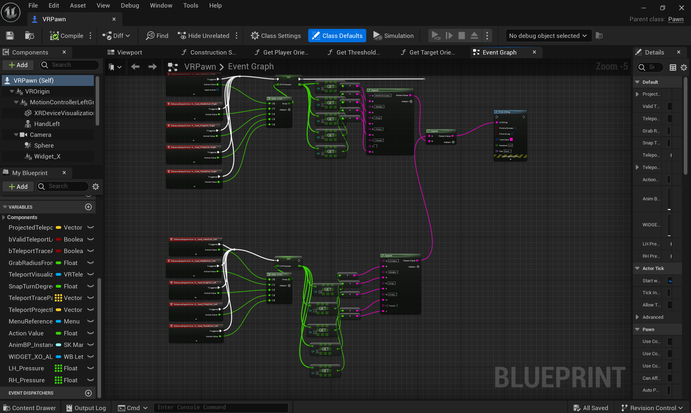
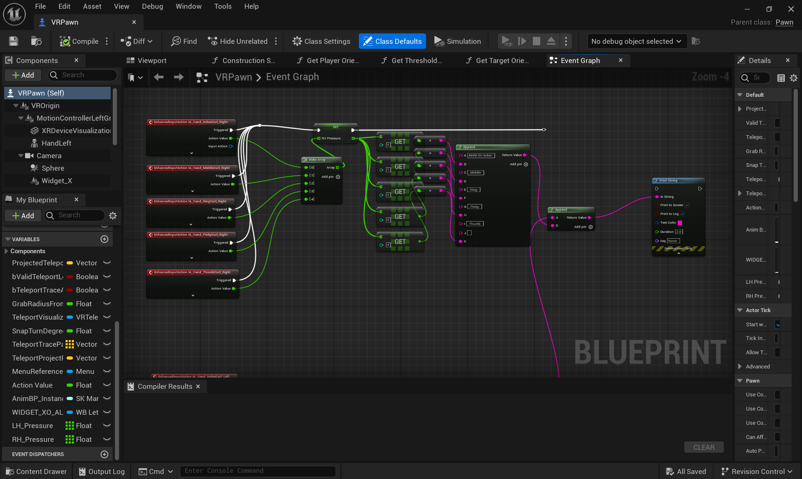

# Recording Etee Pressure Data from Unreal Engine 5.3

A documentation and tutorial for recording and streaming pressure data from **Etee VR Controllers** using Unreal Engine 5.3 and Lab Streaming Layer (LSL). This system records individual finger pressure values along with hand and headset tracking data for research.

## 🎯 Overview

This project enables real-time data collection from Etee VR controllers, including:
- **Individual finger pressure** data (thumb, index, middle, ring, pinky)
- **Hand position and orientation** 
- **Headset position and orientation** 
- **Real-time data streaming** via LSL, lab recorder for data analysis

## 📋 Prerequisites

Before starting, ensure you have:

- **Hardware:**
  - Etee VR Controllers
  - VR Headset (Meta Quest Pro HMD is used)
  - Vive Ultimate Trackers (These trackers are essential to use Etee VR Controllers with Quest HMD.)  
- **Software:**
  - Unreal Engine 5.3
  - SteamVR
  - Lab Streaming Layer (LSL) plugin, Lab Recorder (for data recording) 

  - Quest Link
  - Vive Hub (See [separate repository](https://github.com/SAEFP/etee-controllers-with-meta-quest-pro) for detailed Etee + Vive Ultimate tracker setup.)

## 📚 Table of Contents

- [Overview](#-overview)
- [Prerequisites](#-prerequisites)
- [SteamVR Setup](#-steamvr-setup)
  - [Configure Input Bindings](#a-configure-input-bindings)
  - [Assign Trackers](#b-assign-trackers)
- [Unreal Engine Setup](#-unreal-engine-setup)
  - [Input Mapping](#-input-mapping)
  - [VR Pawn Configuration](#-vr-pawn-configuration)
- [LSL Cube Actor](#-lsl-cube-actor)
  - [Components](#components)
  - [Event Graph Logic](#event-graph-logic)
- [Data Recording](#-data-recording)

## 🔧 SteamVR Setup

### A. Configure Input Bindings

> **⚠️ Important**: Complete this step **after** starting VR Preview in your Unreal project!

1. **Launch SteamVR**
2. **Navigate to Controller Settings**:
   - Go to **Devices > Controller Settings > Manage Bindings**
3. **Select Input Mapping Context**: Choose `IMC_hands`

**Why this matters**: Through editing the `IMC_Hands`, Unreal Engine will know how to interpret the input data from the controllers. For this project, only the trackpad is used as a button.

 

### B. Assign Trackers 

> **📝 Note**: Etee VR Controllers work with Quest headsets using Vive Ultimate trackers. Ensure trackers are assigned to the correct hands for accurate calibration. See our [separate repository](link-to-repo) for detailed Etee + Vive Ultimate tracker setup.

1. **Open SteamVR Settings**: Navigate to **Settings > Manage Trackers**
2. **Assign Vive Ultimate Trackers** to:
   - ✅ Right Hand
   - ✅ Left Hand

 
 

## Unreal Engine Setup

### 🎯 Input Mapping

#### Setting up Enhanced Input in `IMC_Hands`:

**Configuration Steps**:
1. Navigate to **Content Browser > VR Template > Input**
2. Select `IMC_Hands`
3. Add each Input Action written below

| Input Action 
|--------------|
| `IA_Hand_ThumbCurl_Left` | 
| `IA_Hand_ThumbCurl_Right` | 
| `IA_Hand_IndexCurl_Left` | 
| `IA_Hand_IndexCurl_Right` | 
| `IA_Hand_MiddleCurl_Left` | 
| `IA_Hand_MiddleCurl_Right` | 
| `IA_Hand_RingCurl_Left` | 
| `IA_Hand_RingCurl_Right` | 
| `IA_Hand_PinkyCurl_Left` | 
| `IA_Hand_PinkyCurl_Right` | 

 

### 🧍 VR Pawn

In your `VRPawn` Blueprint, create the following variables to store pressure data:

| Variable Name | Type | 
|---------------|------|
| `RH_Pressure` | Float | 
| `LH_Pressure` | Float | 

- These represent total pressure from the right and left hands.

#### In Event Graph:

For each input:

1. Use the `Input Action` node for each finger (e.g. `IA_Hand_IndexCurl_Right`)

- Input Actions which are events that happens when you move or press something (like curling your index finger) is used.

- For each finger (thumb, index, middle, etc.), we set up an input action, like: IA_Hand_IndexCurl_Right and IA_Hand_ThumbCurl_Left

2. Connect to a `Set` node to update `RH_Pressure`

- When an input action is triggered (for example, when you curl your index finger), we use a Set node to store that finger’s pressure value in a variable.

3. Store values in a pressure array with 5 elements:

|0|Index|
|1|Middle|
|2|Ring|
|3|Pinky|
|4|Thumb|

- We collect all finger pressures in a list (called an array). 

Repeat the same for `LH_Pressure`.

     
        
 

## LSL Cube

- We created another Blueprint actor called the  `LSL_Cube`. It runs constantly (using Event Tick, which updates every frame). It records the finger pressure values and hand position/orientation and headset position/orientation. It combines everything into one array (a long list of values).

### Components in the LSL Cube

| LSLOutletMarkers |
| LSLOutlet_Headset |
| LSLOutlet_RH |
| LSLOutlet_LH |
 

- These LSL stream outlets streams all the data to LSL including position and orientation of the controllers and the headset and pressure data from each finger.

### Event Graph Logic

#### Step-by-step:

1. **Event Tick** → `Get Player Pawn`
2. Cast to `VRPawn`
3. Access `RH_Pressure` and pressure array
4. Use 5 `Get` nodes to extract individual finger values
5. Retrieve `Hand_Right` socket location and rotation
- Use `Get Socket Location` and `Get Socket Rotation`
- Break the vectors into X/Y/Z and Pitch/Yaw/Roll.

- We also get the hand’s position and rotation from the VR Pawn by checking the socket on the hand. This gives us: Position (X, Y,Z)and Orientation (Pitch, Yaw, Roll)

 

6. Create a final array using `Make Array`and identify the name of the each index for each hand:

|Index 0 | Position X |
|Index 1 | Position Y |
|Index 2 | Position Z |
|Index 3 | Orientation X (Pitch) |
|Index 4 | Orientation Y (Yaw) |
|Index 5 | Orientation Z (Roll) |
|Index 6 | Index Pressure |
|Index 7 | Middle Pressure |
|Index 8 | Ring Pressure |
|Index 9 | Pinky Pressure |
|Index 10 | Thumb Pressure |

 

7. **Stream Data**: Send arrays using `Push Sample` to respective outlets:
   - Right hand data → `LSLOutlet_RH`
   - Left hand data → `LSLOutlet_LH` (same structure)

## 📊 Data Recording

### Setting up LabRecorder

1. **Install LabRecorder**: Download from [LSL Repository](https://github.com/labstreaminglayer/App-LabRecorder)
2. **Launch LabRecorder**: Start the application
3. **Detect Streams**: LabRecorder should automatically detect your LSL streams

### Recording Process

1. **Select Streams**: Check the streams you want to record
2. **Set Filename**: Choose output location and filename (`.xdf` format)
3. **Start Recording**: Click "Start" to begin data capture
4. **Perform VR Session**: Use your Etee controllers in the VR environment
5. **Stop Recording**: Click "Stop" when finished

