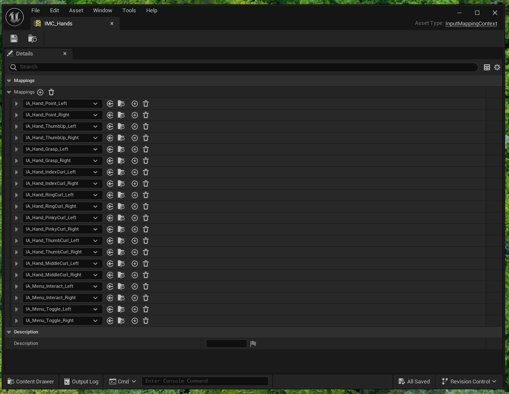
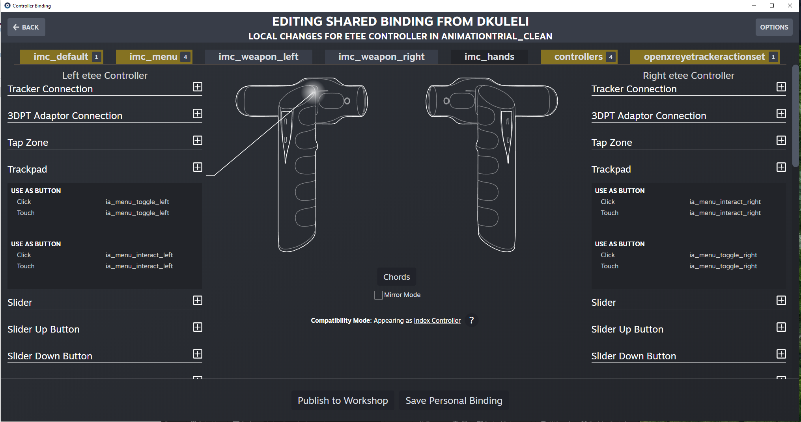
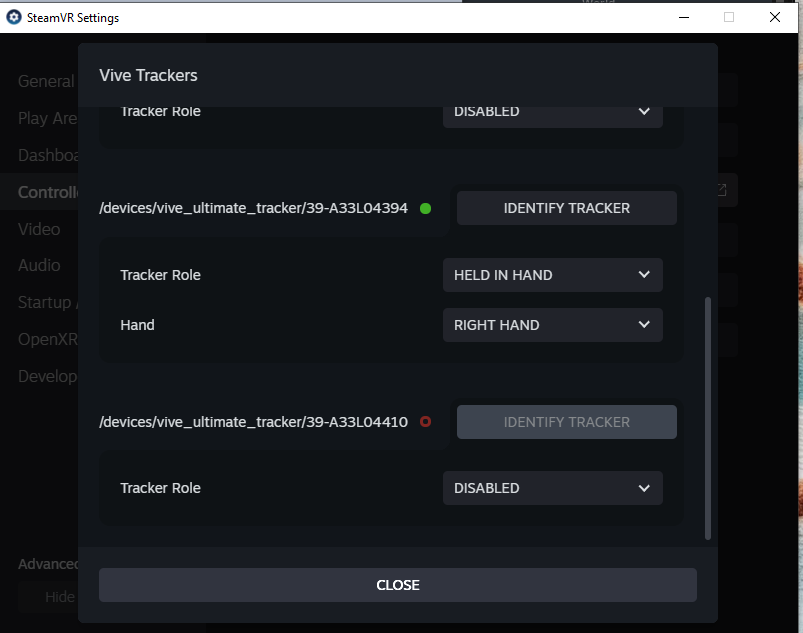
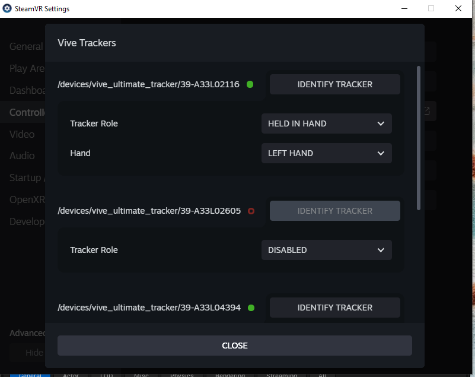
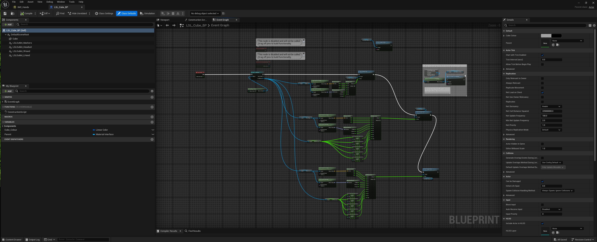
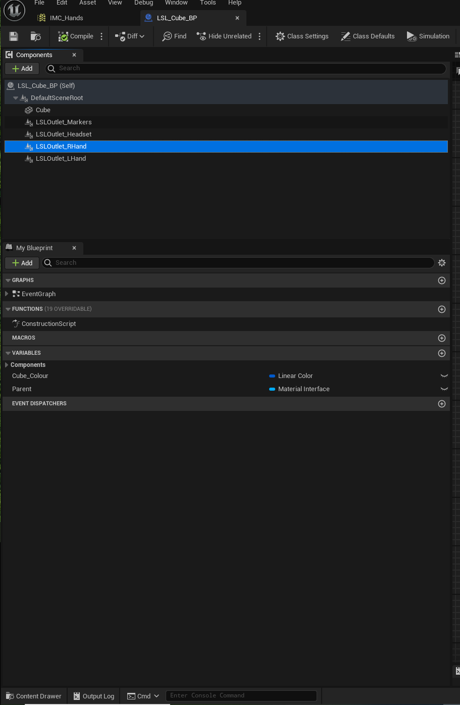
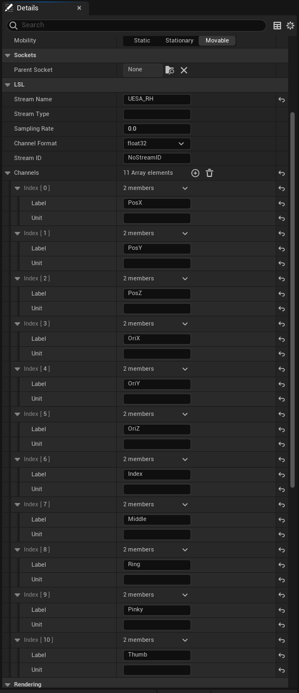

_RECORDING ETEE PRESSURE DATA FROM UNREAL ENGINE 5.3_

Event Graph of the VR Pawn in Unreal Engine 5.3 for recording pressure data from each finger 

     
        
 

IMC hands specified for etee VR controllers

 

IMC hand bindings for Etee Controllers inside the Steam VR

 

Specifiying the hands for the Vive Ultimate trackers inside the Steam VR settings- Manage trackers section

 
 

LSL Cube event graph in Unreal Engine 5.3

 
 
 